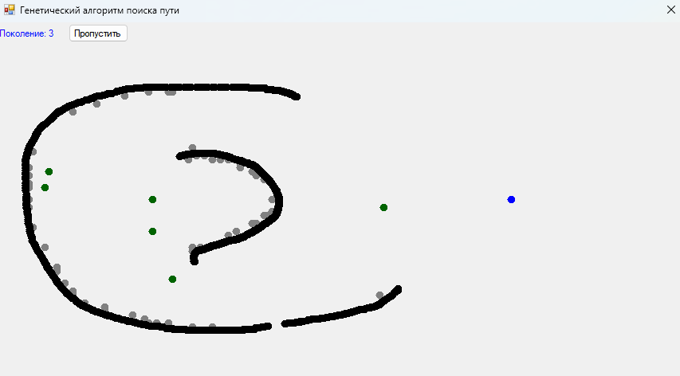

# Genetic Pathfinder

## Description
A C# program that demonstrates path finding based on a genetic algorithm in which black dots slowly evolve generation by generation making it closer and closer to the target trying to avoid walls until eventually reaching the goal. I wrote the program when I was in university in 2018 as an exercise while studying genetic programming. When developing this, I was highly inspired by [this](https://habr.com/ru/post/128704/) article describing the topic. 

## Requirements
A Microsoft .NET redistributable installation is probably required to run.

## Quick start
Run `Genetic Pathfinder\bin\Debug\Genetic Pathfinder.exe`.

## How to play
1. Place walls on the field like you're painting on a canvas.
2. Click a button in the top-left corner to start the evolution.
3. Watch they evolve.
